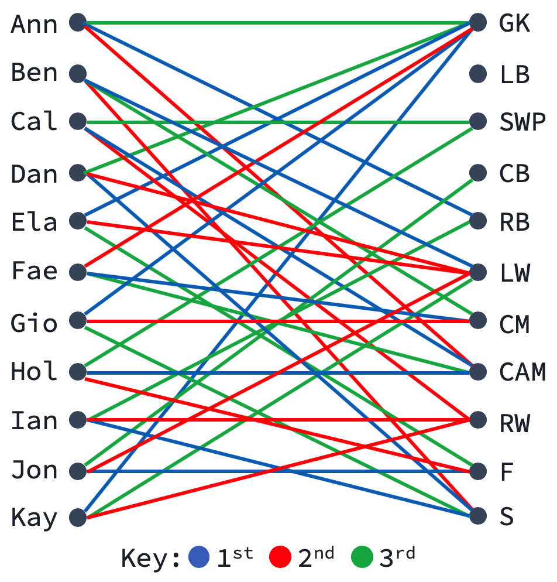

# Hungarian Algorithm

A Python 3 implementation of the **Hungarian Algorithm** (a.k.a. the Kuhn-Munkres algorithm), an O(n^3) solution for the **assignment problem**, or **maximum-weighted bipartite matching problem**.

## Example

Suppose you're choosing 11 starting positions for a soccer team. 

The 11 players submit their top 3 position choices, and it is your job to create the optimal team.

The situation can be modeled with a **weighted bipartite graph**:



Then, if you assign weight 3 to blue edges, weight 2 to red edges and weight 1 to green edges, your job is simply to find the matching that maximizes total weight. This is the **assignment problem**, for which the **Hungarian Algorithm** offers a solution.

*Notice: although no one has chosen LB, the algorithm will still assign a player there. In fact, the first step of the algorithm is to create a complete bipartite graph (all possible edges exist), giving new edges weight 0.*

## Usage

### Import 

```python
from algorithm import hungarian_algorithm
```
### Required Input

Define your **weighted bipartite graph** in the following manner:

```python
G = {
	'Ann': {'RB': 3, 'CAM': 2, 'GK': 1},
	'Ben': {'LW': 3, 'S': 2, 'CM': 1},
	'Cal': {'CAM': 3, 'RW': 2, 'SWP': 1},
	'Dan': {'S': 3, 'LW': 2, 'GK': 1},
	'Ela': {'GK': 3, 'LW': 2, 'F': 1},
	'Fae': {'CM': 3, 'GK': 2, 'CAM': 1},
	'Gio': {'GK': 3, 'CM': 2, 'S': 1},
	'Hol': {'CAM': 3, 'F': 2, 'SWP': 1},
	'Ian': {'S': 3, 'RW': 2, 'RB': 1},
	'Jon': {'RB': 3, 'CAM': 2, 'GK': 1},
	'Kay': {'GK': 3, 'RW': 2, 'LW': 1, 'LB': 0}
}
```

thus defining a **complete bipartite graph** G = (L &#8746; R, E) with:

* Vertex set L (Players) = {'Ann', 'Ben', 'Cal', 'Dan', 'Ela', 'Fae', 'Gio', 'Hol', 'Ian', 'Jon', 'Kay'}
* Vertex set R (Positions) = {'GK', 'LB', 'SWP', 'CB', 'RB', 'LW', 'CM', 'CAM', 'RW', 'F', 'S'}
* Edge set E = {*e* = *(Player, Position)* : for all Players, for all Positions}
* Weight function:
	* w(*Player*, *Position*) = 3 for a first choice
	* w(*Player*, *Position*) = 2 for a second choice
	* w(*Player*, *Position*) = 1 for a third choice
	* w(*Player*, *Position*) = 0 otherwise

Then pass the graph as an input:

```python
hungarian_algorithm(G)
```

### Output

Determine your desired output with an optional input. For an output listing *Player - Position* pairs in the **maximum-weighted matching** along with w(*Player*, *Position*), use the input 'list' (default):

```python
hungarian_algorithm(G, 'list')
# -> [('Ela-GK', 3), ('Ben-LW', 3), ('Cal-CAM', 3), ('Dan-S', 3), ('Ann-SWP', 0), ('Ian-RW', 2), ('Hol-F', 2), ('Fae-CM', 3), ('Jon-RB', 3), ('Gio-LB', 0)]
```

For an output of the total weight of the **maximum-weighted matching**, use the input 'total':

```python
hungarian_algorithm(G, 'total')
# -> 22
```

## History

The algorithm was published by Harold Kuhn in 1955 paper "The Hungarian Method for the Assignment Problem." Kuhn's work relied heavily on that of Hungarian mathematicians D&eacute;nes K&#337;nig and Jen&#337; Eg&eacute;vary.
